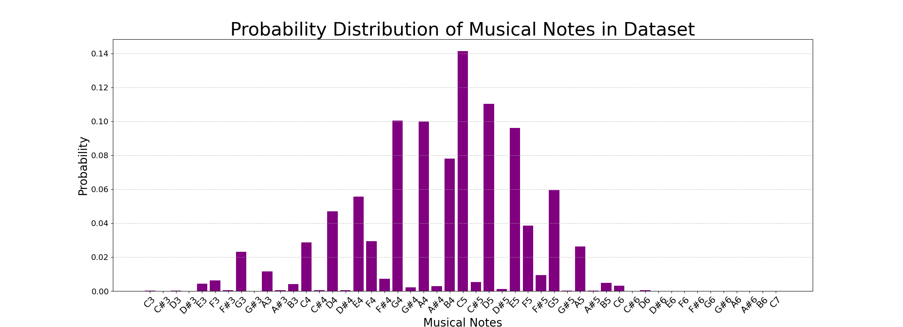
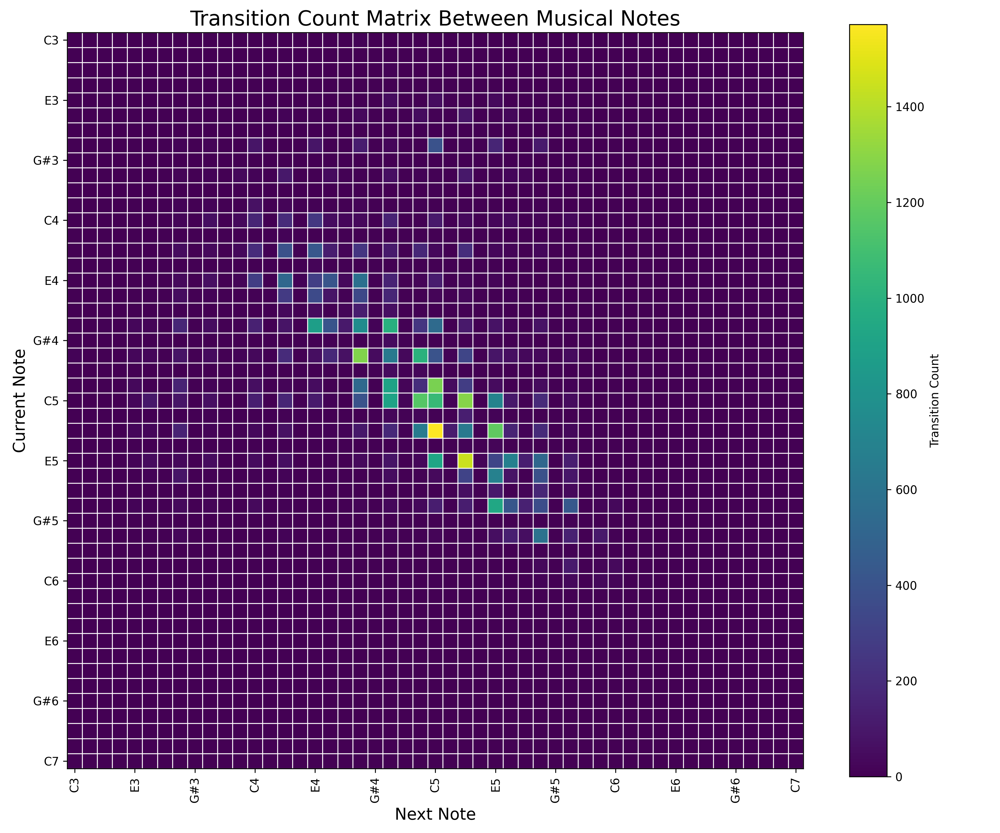

<h1 align="center">
    🎶 Modeling Melodies - A Statistical Approach 🎶  </a>
</h1>

  This project applies concepts from Statistical Mechanics to analyze musical corpora and generate new melodies using the Metropolis Monte Carlo algorithm.

  
  
  

  
    &nbsp;
  

---

# 📄 Project Description

This project was developed to explore the intersection of Physics and Music. By treating a melody as a chain of interacting states (notes), we model the composition process as a thermodynamic system seeking equilibrium.

The code extracts statistical properties from a music dataset — specifically the intrinsic note probability (external field $h$) and note-to-note transition probabilities (interaction matrix $J$) — to define a Hamiltonian energy function. Using Metropolis Monte Carlo (MCMC) simulations, we generate novel melodies by controlling the system's temperature, allowing us to navigate between rigid order (monotony) and random disorder (white noise).

# 📁 Access and Usage

**You can access the source code by downloading the notebook `Modeling_Melodies.ipynb` from this repository.**

### How to run:
1.  **Dependencies:** Ensure you have Python installed along with the required libraries (see below).
2.  **Training:** Run the initial cells to parse the corpus and calculate the $h$ vector and $J$ matrix.
3.  **Simulation:** Use the interactive cells to set the simulation length ($L$) and Temperature ($T$).
4.  **Output:** The code will generate a plot of the melody evolution and render a `.wav` audio file.

**Files included in the repository:**
- **`Modeling_Melodies.ipynb`**: Main notebook containing the logic for training and MCMC simulation.
- **`Figures/`**: Folder containing transition heatmaps, energy plots, and melody visualizations.
- **`Audio/`**: Folder containing the generated `.wav` files (songs) at different temperatures.

# ⚙️ Features

- **`Corpus Analysis & Parameter Estimation`**: 
  - Calculates the **External Field ($h$)**: The intrinsic probability/energy of each note.
  - Calculates the **Interaction Matrix ($J$)**: The transition probabilities between adjacent notes (Markov Chain).
  
- **`Thermodynamic Modeling`**: 
  - Defines the system's Hamiltonian: $H = - \sum_{\langle i,j \rangle} J(\sigma_i \sigma_j) -  \sum_i h(\sigma_i)$
    
    Where $\sigma_i, \sigma_j$ is the adjacent notes 
  
- **`Metropolis Monte Carlo Simulation`**: 
  - Implements the MCMC algorithm to evolve a random melody towards a stable energy state based on the Boltzmann distribution.
  
- **`Temperature Control`**: 
  - Allows the user to vary $T$ to observe phase transitions:
    - **Low T**: Ground state (Frozen/Monotonous).
    - **Intermediate T**: Structured/Creative melodies (Critical regime).
    - **High T**: White noise (Paramagnetic/Chaotic).

# 🎥 Application Demo

***Probability Distribution:***
*Calculating the probability distribution of the dataset notes, used to derive the $h$ vector.*

***Transition Matrix Heatmap (J):***
*Visualizing the probability of note-to-note transitions derived from the corpus.*

***Melody Evolution at Low Temperature (T=0.001):***
*A monotonous, unchanging sequence, where the system collapses into the ground state energy.*

***Melody Evolution at Intermediate Temperature (T=30):***
*A coherent melody emerging from the simulation, balancing order and variation.*

***Melody Evolution at High Temperature (T=1000):***
*A chaotic sequence where thermal noise dominates the musical rules.*

# 🖥️ Tools Used
- **Jupyter Notebook**: Main development environment.
- **Libraries:**
    - **NumPy**: For matrix operations and vector calculus.
    - **Matplotlib**: For plotting heatmaps ($J$ matrix) and "piano roll" visualizations.
    - **Pandas**: For data handling.
    - **SciPy**: For auxiliary statistical functions.
    - **IPython.display**: For playing audio directly in the notebook.

# 🔎 References
- **Statistical Mechanics of Music**: Methods to model composition using Ising/Potts models.
- **Metropolis Algorithm**: *Equation of State Calculations by Fast Computing Machines* (1953).
- **Algorithmic Composition**: Techniques for generating music using Markov Chains and stochastic processes.
- **Folk Tune Finder**: Dataset of different music genres, varying rhythm keys, modes and more. 

# 🫂 Acknowledgments
- **Prof. Felipe David Crasto de Lima** - Responsible for the course/discipline where this work was developed. Helped with the assembly of the algorithms used, adapting them for the statistical analysis.

# 👨‍💻 Developers

| [Caio M. Leão Dantas ](https://github.com/Caiomld) |  [Enzo J. Xavier ](https://github.com/EnzoJanuzzi) |  [Rafael A. S. Santos ](https://github.com/RafaelShaikhzadeh) | [Thomas W. Hannemann ](https://github.com/ThomasHannemann) |
| :---: | :---: | :---: | :---: |
